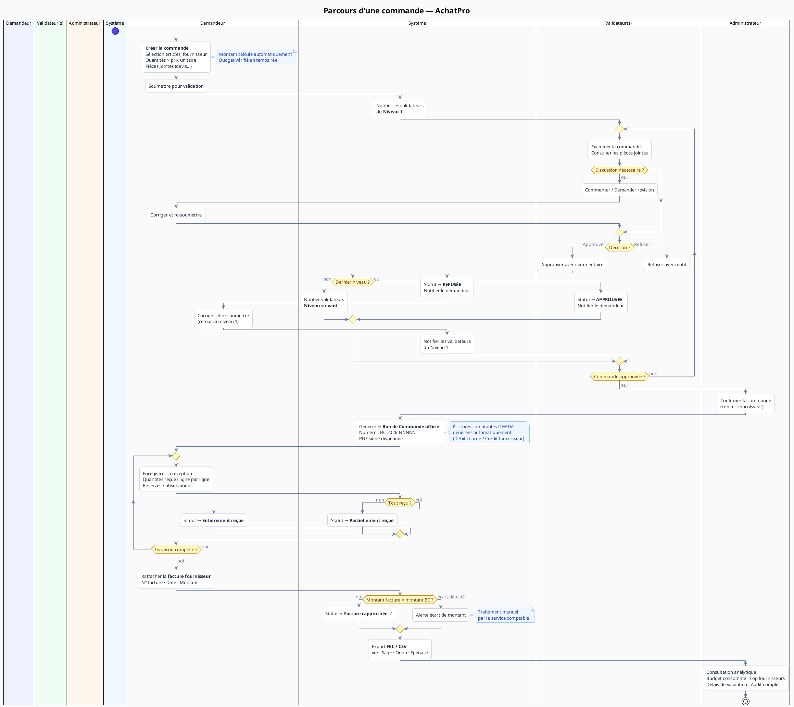

# AchatPro
## La plateforme de gestion des achats conçue pour les entreprises africaines

---

> **"Chaque commande approuvée sans contrôle est une dépense que vous ne maîtrisez plus."**

---

## Sommaire

1. [La réalité de vos achats aujourd'hui](#1-la-réalité-de-vos-achats-aujourd-hui)
2. [Ce que vous perdez chaque mois](#2-ce-que-vous-perdez-chaque-mois)
3. [AchatPro — la solution](#3-achatpro--la-solution)
4. [Comment ça fonctionne](#4-comment-ça-fonctionne)
5. [Ce que vous gagnez, concrètement](#5-ce-que-vous-gagnez-concrètement)
6. [Les fonctionnalités clés](#6-les-fonctionnalités-clés)
7. [Intégration avec vos outils existants](#7-intégration-avec-vos-outils-existants)
8. [Sécurité, conformité et traçabilité](#8-sécurité-conformité-et-traçabilité)
9. [Déploiement et accompagnement](#9-déploiement-et-accompagnement)
10. [Pourquoi AchatPro plutôt qu'un ERP généraliste](#10-pourquoi-achatpro-plutôt-qu-un-erp-généraliste)
11. [Prochaines étapes](#11-prochaines-étapes)

---

## 1. La réalité de vos achats aujourd'hui

Dans la plupart des entreprises de la région, le processus d'achat ressemble à ceci :

```
Le demandeur envoie un message WhatsApp ou un email.
    ↓
Le responsable répond "OK" sans vérifier le budget.
    ↓
La facture arrive en comptabilité sans référence de commande.
    ↓
Personne ne sait qui a commandé quoi, ni si c'était prévu.
    ↓
En fin d'exercice : surprise budgétaire.
```

**Ce n'est pas un problème d'organisation. C'est un problème d'outil.**

---

## 2. Ce que vous perdez chaque mois

| Problème | Conséquence réelle |
|---|---|
| Approbations par email ou WhatsApp | Aucune traçabilité, aucun audit possible |
| Pas de contrôle budgétaire avant approbation | Dépassements découverts trop tard |
| Ressaisie manuelle en comptabilité | Erreurs, perte de temps, retard de clôture |
| Pas de suivi des livraisons | Paiements de marchandises jamais reçues |
| Validateurs absents = commandes bloquées | Retards opérationnels, fournisseurs mécontents |
| Plusieurs points de vente = zéro visibilité globale | Impossible de piloter les dépenses consolidées |

> Un seul dépassement non détecté peut coûter plus cher que plusieurs années d'abonnement à AchatPro.

---

## 3. AchatPro — la solution

**AchatPro** est une application web de gestion des commandes d'achat, développée spécifiquement pour les entreprises multi-sites opérant en Afrique francophone.

Elle couvre l'intégralité du cycle d'achat :

```
Demande d'achat
      ↓
Circuit de validation structuré (multi-niveaux, configurable)
      ↓
Bon de commande officiel numéroté
      ↓
Suivi de livraison (réceptions partielles et complètes)
      ↓
Rapprochement facture fournisseur
      ↓
Export comptable automatique (Sage, Odoo, Epegase...)
```

**Accessible depuis n'importe quel navigateur. Aucune installation requise.**

---

## 4. Comment ça fonctionne

### Le parcours d'une commande



#### Étape 1 — Le demandeur crée la commande

Il sélectionne les articles dans le catalogue, choisit le fournisseur, indique les quantités et les prix. Le montant total est calculé automatiquement. Il joint les devis ou documents nécessaires, puis soumet.

#### Étape 2 — Le circuit de validation s'enclenche

Les validateurs désignés reçoivent une notification. Chaque niveau examine la commande, peut poser des questions ou demander des modifications, puis approuve ou refuse avec un commentaire. La commande ne passe au niveau suivant qu'après approbation complète du niveau en cours.

#### Étape 3 — L'admin confirme et génère le BC officiel

Une fois tous les niveaux validés, l'administrateur confirme la commande auprès du fournisseur. Un **bon de commande numéroté** est généré automatiquement (`BC-2026-00042`), avec l'ensemble des informations de validation.

#### Étape 4 — Suivi de livraison

À la réception des marchandises, les équipes enregistrent les quantités reçues, ligne par ligne. Le système distingue les livraisons partielles et complètes, et alerte automatiquement sur les livraisons en retard.

#### Étape 5 — Rapprochement et comptabilité

La facture fournisseur est attachée à la réception. Le système compare automatiquement le montant facturé au montant du BC et signale tout écart. Les écritures comptables OHADA sont générées et exportées en un clic vers Sage, Odoo ou Epegase.

---

## 5. Ce que vous gagnez, concrètement

### Contrôle financier en temps réel

| Avant AchatPro | Avec AchatPro |
|---|---|
| Budget découvert en fin de mois | Alerte dès que le seuil de 80% est atteint |
| Dépassements impossibles à anticiper | Blocage ou alerte automatique avant engagement |
| Dépenses par boutique inconnues | Tableau de bord consolidé en temps réel |
| Clôture comptable laborieuse | Export FEC/CSV automatique à chaque BC confirmé |

### Traçabilité totale

Chaque décision est enregistrée avec l'identité de l'approbateur, l'horodatage et le commentaire. En cas d'audit, vous pouvez justifier l'intégralité de vos dépenses en quelques clics.

### Gain de temps opérationnel

- Plus de relances par WhatsApp pour savoir où en est une commande
- Plus de ressaisie manuelle dans le logiciel comptable
- Les validateurs absents peuvent déléguer leurs droits temporairement : aucune commande bloquée

### Pilotage stratégique

- Quels sont vos fournisseurs les plus sollicités ?
- Quelles catégories de dépenses explosent ?
- Quel validateur est le plus lent à traiter ?

Toutes ces réponses sont disponibles en temps réel, sans extraire la moindre feuille Excel.

---

## 6. Les fonctionnalités clés

### Gestion des commandes d'achat

- Création guidée avec catalogue d'articles et fournisseurs pré-approuvés
- Lignes de détail (quantité × prix unitaire = total automatique)
- Pièces jointes (devis, bons de commande proforma...)
- Numérotation officielle automatique (`BC-AAAA-NNNNN`)
- Export PDF du bon de commande signé
- Historique complet des modifications

### Circuit de validation multi-niveaux

- Nombre de niveaux configurable (1 à N) selon votre organisation
- Chaque niveau a ses validateurs attitrés
- Notification automatique à chaque étape (email + in-app)
- Discussion directe sur la commande entre demandeur et validateurs
- Demande de révision sans refus formel (la commande reste suspendue)
- Délégation de validation pendant les absences, avec traçabilité complète

### Gestion budgétaire

- Budgets par boutique, par catégorie, ou par les deux
- Périodes annuelles ou mensuelles
- Consommation calculée en temps réel : montant engagé vs disponible
- Alertes visuelles à 80% puis à 100% de consommation
- Vue consolidée de tous les budgets dans le tableau de bord admin

### Suivi des réceptions et livraisons

- Enregistrement ligne par ligne des quantités reçues
- Réceptions partielles multiples sur un même BC
- Statuts automatiques : Commandée → Partiellement reçue → Entièrement reçue
- Rattachement de la facture fournisseur (numéro, date, montant)
- Détection automatique des écarts entre BC et facture

### Intégration comptable OHADA / SYSCOHADA

- Mapping des comptes comptables sur les catégories d'articles
- Génération automatique des écritures à la confirmation du BC
- Export **FEC** (standard Sage / Odoo)
- Export **CSV** (compatible Epegase, Excel, tout logiciel d'import)
- Rapprochement BC / facture avec statut visuel

### Analytique et pilotage

- Top 5 fournisseurs par volume d'achats
- Top 5 catégories de dépenses
- Dépenses mensuelles par boutique (courbe sur 6 mois)
- Délai moyen de validation par niveau et par validateur
- Taux de refus par demandeur
- Commandes bloquées depuis plus de 3 jours (alerte automatique)
- Audit & historique exportable (PDF, Excel)

### Administration centralisée

- Gestion des boutiques / points de vente
- Gestion des utilisateurs et des rôles (demandeur, validateur, admin)
- Catalogue d'articles avec prix de référence
- Référentiel fournisseurs approuvés
- Configuration du circuit de validation en quelques clics

---

## 7. Intégration avec vos outils existants

AchatPro ne remplace pas votre logiciel comptable : il **l'alimente automatiquement**.

| Logiciel | Mode d'intégration | Format |
|---|---|---|
| **Sage 100 / Sage X3** | Import du fichier FEC | `.txt` séparé par `\|` |
| **Odoo** | Import journal des achats | Format FEC compatible |
| **Epegase** | Import CSV paramétré | `.csv` UTF-8 avec BOM |
| **Excel / autres** | Export CSV universel | `.csv` séparé par `;` |

### Ce que vous importez dans votre comptabilité

Pour chaque BC confirmé, AchatPro génère automatiquement :

```
DÉBIT  [Compte de charge OHADA]    [Montant ligne]    "Achat Article X — BC-2026-00042"
...
CRÉDIT [Compte fournisseur 401xxx]  [Montant total BC]  "Fournisseur — BC-2026-00042"
```

**Résultat : zéro ressaisie, zéro erreur de saisie, clôture mensuelle accélérée.**

---

## 8. Sécurité, conformité et traçabilité

### Contrôle d'accès par rôle

Chaque utilisateur n'accède qu'à ce que son rôle lui permet :

| Rôle | Ce qu'il voit et peut faire |
|---|---|
| **Demandeur** | Ses propres commandes, leur statut, les échanges |
| **Validateur** | Les commandes en attente à son niveau de validation |
| **Administrateur** | Tout : commandes, budgets, analytics, comptabilité, paramétrage |

### Journal d'audit immuable

Chaque action est tracée : qui a créé, soumis, approuvé, refusé, réceptionné, quand et avec quel commentaire. Ce journal est exportable en PDF ou Excel pour tout contrôle interne ou externe.

### Délégation de validation tracée

Quand un validateur délègue à un intérimaire, chaque validation effectuée par délégation est clairement identifiée dans l'historique avec les deux noms (délégant et délégataire).

### Conformité OHADA

Le plan de comptes et les formats d'export respectent le référentiel **SYSCOHADA révisé**, utilisé dans les 17 États membres de l'OHADA (Cameroun, Côte d'Ivoire, Sénégal, Gabon, Congo, etc.).

---

## 9. Déploiement et accompagnement

### Une mise en production rapide

| Étape | Durée estimée | Description |
|---|---|---|
| Configuration initiale | Jour 1 | Boutiques, utilisateurs, niveaux de validation |
| Catalogue & fournisseurs | Jour 1–2 | Import ou saisie du catalogue d'articles |
| Mapping comptable | Jour 2 | Association catégories → comptes OHADA |
| Formation utilisateurs | Jour 3 | Session démo + prise en main guidée |
| Mise en production | Jour 4–5 | Go live avec accompagnement |

**Délai typique de mise en production : moins d'une semaine.**

### Pas de migration complexe

AchatPro ne nécessite pas de migration de données historiques pour démarrer. Les premières commandes peuvent être créées dès le premier jour.

### Formation et support

- Guide utilisateur intégré
- Support réactif par email et téléphone
- Mises à jour régulières incluses dans l'abonnement

---

## 10. Pourquoi AchatPro plutôt qu'un ERP généraliste ?

| Critère | ERP généraliste | AchatPro |
|---|---|---|
| Délai de déploiement | 3 à 18 mois | 1 semaine |
| Complexité de prise en main | Élevée | Intuitive |
| Coût d'implémentation | Élevé (consulting) | Inclus |
| Adapté aux spécificités Afrique | Parfois | Conçu pour |
| Intégration comptable OHADA | Variable | Native |
| Circuit de validation configurable | Complexe | Simple, visuel |
| Mises à jour | Lourdes | Continues, transparentes |
| Remplacement de l'existant | Souvent oui | Non — complémentaire |

> AchatPro ne cherche pas à remplacer votre ERP ou votre logiciel comptable. Il s'y connecte, le nourrit automatiquement, et vous offre une visibilité que vous n'aviez pas avant.

---

## 11. Prochaines étapes

Nous proposons une **démonstration personnalisée** d'AchatPro sur vos propres données :

1. **Démonstration live** (45 min) — Nous configurons l'application avec votre organigramme, vos boutiques et votre circuit de validation pour que vous voyiez exactement ce que ce sera chez vous.

2. **Période d'essai** (2 semaines) — Accès complet à l'application pour votre équipe, avec accompagnement inclus.

3. **Proposition commerciale** — Adaptée à votre taille, votre nombre d'utilisateurs et vos besoins spécifiques.

---

### Nous contacter

> **Demandez votre démonstration dès aujourd'hui.**
>
> Chaque semaine sans AchatPro, c'est une semaine de dépenses non maîtrisées, de validations non tracées, et de ressaisies manuelles évitables.

---

*AchatPro — Développé avec soin pour les entreprises qui prennent leurs achats au sérieux.*
